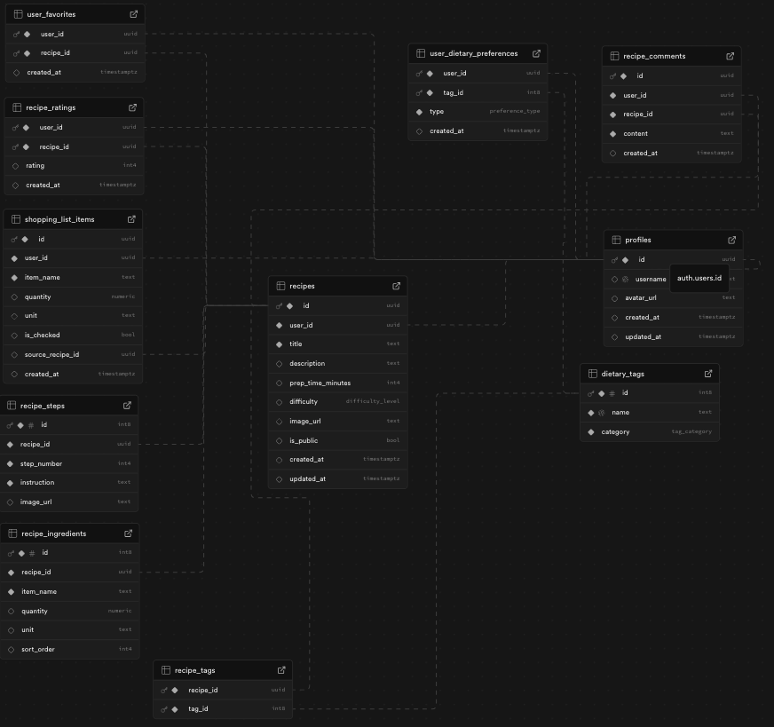

# Database documentation (Supabase)

## User profiles and favorites functionality

**Table:** `profiles`

| Column Name | Data Type | Description                                   |
| ----------- | --------- | --------------------------------------------- |
| id          | UUID      | Unique identifier for each user               |
| username    | VARCHAR   | User's username (unique)                      |
| avatar_url  | VARCHAR   | URL for the avatar image (stored on Supabase) |
| created_at  | TIMESTAMP | Timestamp of when the profile was created     |
| updated_at  | TIMESTAMP | Timestamp of the last profile update          |

Example JSON:

```json
{
  "id": "aa11bb22-cc33-dd44-ee55-ff6677889900",
  "username": "JanKucharz",
  "avatar_url": "https://grocery_helper_app_db.supabase.co/storage/avatars/jan.jpg",
  "created_at": "2023-10-27T10:00:00Z",
  "updated_at": "2024-06-15T12:30:00Z"
}
```

**Table:** `user_favorites`

| Column Name | Data Type | Description                                  |
| ----------- | --------- | -------------------------------------------- |
| user_id     | UUID      | Foreign key referencing the `profiles` table |
| recipe_id   | UUID      | Foreign key referencing the `recipes` table  |
| created_at  | TIMESTAMP | Timestamp of when the favorite was added     |

Example JSON:

```json
{
  "user_id": "aa11bb22-cc33-dd44-ee55-ff6677889900",
  "recipe_id": "550e8400-e29b-41d4-a716-446655440000",
  "created_at": "2024-06-15T12:30:00Z"
}
```

Example JSON for user profile with favorites:

```json
{
  "id": "aa11bb22-cc33-dd44-ee55-ff6677889900",
  "username": "JanKucharz",
  "avatar_url": "https://grocery_helper_app_db.supabase.co/storage/avatars/jan.jpg",
  "favorites": [
    {
      "id": "550e8400-e29b-41d4-a716-446655440000",
      "title": "Kremowe Risotto z Grzybami",
      "description": "Opis dania...",
      "prep_time_minutes": 45,
      "difficulty": "Medium",
      "image_url": "https://twoja-baza.supabase.co/storage/v1/object/public/recipes/risotto.jpg"
    }
  ]
}
```

## Recipe functionality

All the recipes data is stored 3 tables.

**Table:** `recipes`

| Column Name       | Data Type | Description                                               |
| ----------------- | --------- | --------------------------------------------------------- |
| id                | UUID      | Unique identifier for each recipe                         |
| title             | VARCHAR   | Title of the recipe                                       |
| description       | TEXT      | Description of the recipe                                 |
| prep_time_minutes | INTEGER   | Preparation time in minutes                               |
| difficulty        | VARCHAR   | Difficulty level of the recipe (e.g., Easy, Medium, Hard) |
| image_url         | VARCHAR   | URL for the recipe image (stored on Supabase)             |
| is_public         | BOOLEAN   | Indicates if the recipe is public or private              |
| created_at        | TIMESTAMP | Timestamp of when the recipe was created                  |
| updated_at        | TIMESTAMP | Timestamp of the last recipe update                       |
| user_id           | UUID      | Foreign key referencing the `profiles` table              |

Example JSON:

```json
{
  "id": "550e8400-e29b-41d4-a716-446655440000",
  "user_id": "aa11bb22-cc33-dd44-ee55-ff6677889900",
  "title": "Domowa Pizza Neapolitańska",
  "description": "Sekret tkwi w długim wyrastaniu ciasta (minimum 24h). Piec w maksymalnej temperaturze!",
  "prep_time_minutes": 90,
  "difficulty": "Hard",
  "image_url": "https://twoja-baza.supabase.co/storage/v1/object/public/recipes/pizza.jpg",
  "is_public": true,
  "created_at": "2023-10-27T12:00:00.000Z",
  "updated_at": "2023-10-28T14:30:00.000Z"
}
```

**Table:** `recipe_ingredients`

| Column Name | Data Type | Description                                           |
| ----------- | --------- | ----------------------------------------------------- |
| id          | UUID      | Unique identifier for each ingredient entry           |
| recipe_id   | UUID      | Foreign key referencing the `recipes` table           |
| item_name   | VARCHAR   | Name of the ingredient                                |
| quantity    | VARCHAR   | Quantity of the ingredient (e.g., "2 cups", "1 tbsp") |
| unit        | VARCHAR   | Unit of measurement (e.g., "grams", "ml")             |
| sort_order  | INTEGER   | Order of the ingredient in the recipe                 |

Example JSON:

```json
{
  "id": "660e8400-e29b-41d4-a716-446655440000",
  "recipe_id": "550e8400-e29b-41d4-a716-446655440000",
  "item_name": "Mąka typu 00",
  "quantity": "500",
  "unit": "grams",
  "sort_order": 1
}
```

**Table:** `recipe_steps`

| Column Name | Data Type | Description                                 |
| ----------- | --------- | ------------------------------------------- |
| id          | UUID      | Unique identifier for each step entry       |
| recipe_id   | UUID      | Foreign key referencing the `recipes` table |
| step_number | INTEGER   | Step number in the recipe                   |
| instruction | TEXT      | Instruction for the step                    |
| image_url   | VARCHAR   | URL for the step image (stored on Supabase) |

Example JSON:

```json
{
  "id": "770e8400-e29b-41d4-a716-446655440000",
  "recipe_id": "550e8400-e29b-41d4-a716-446655440000",
  "step_number": 1,
  "instruction": "W dużej misce wymieszaj mąkę, sól i drożdże.",
  "image_url": "https://twoja-baza.supabase.co/storage/v1/object/public/recipe_steps/step1.jpg"
}
```

Example JSON for the recipe with steps and ingredients (detailed view):

```json
{
  "id": "550e8400-...",
  "title": "Kremowe Risotto z Grzybami",
  "description": "Opis dania...",
  "recipe_ingredients": [
    {
      "item_name": "Ryż Arborio",
      "quantity": 300,
      "unit": "g"
    }
  ],
  "recipe_steps": [
    {
      "step_number": 1,
      "instruction": "Rozgrzej masło...",
      "image_url": null
    }
  ]
}
```

Example JSON for the recipe list view + author:

```json
[
  {
    "id": "550e8400-...",
    "title": "Kremowe Risotto z Grzybami",
    "description": "Opis dania...",
    "prep_time_minutes": 45,
    "difficulty": "Medium",
    "image_url": "https://twoja-baza.supabase.co/storage/v1/object/public/recipes/risotto.jpg",
    "profiles": {
      "username": "JanKucharz"
    }
  },
  {
    "id": "660e8400-...",
    "title": "Domowa Pizza Neapolitańska",
    "description": "Sekret tkwi w długim wyrastaniu ciasta...",
    "prep_time_minutes": 90,
    "difficulty": "Hard",
    "image_url": "https://twoja-baza.supabase.co/storage/v1/object/public/recipes/pizza.jpg",
    "profiles": {
      "username": "AnnaKucharka"
    }
  }
]
```

## Tags and preferences functionality

Tags and preferences are stored in three tables.

**Table:** `dietary_tags`

| Column Name | Data Type | Description                            |
| ----------- | --------- | -------------------------------------- |
| id          | UUID      | Unique identifier for each dietary tag |
| name        | VARCHAR   | Name of the dietary tag (e.g., Vegan)  |

Example JSON:

```json
{
  "id": "880e8400-e29b-41d4-a716-446655440000",
  "name": "Vegan"
}
```

**Table:** `recipe_tags`

| Column Name | Data Type | Description                                      |
| ----------- | --------- | ------------------------------------------------ |
| recipe_id   | UUID      | Foreign key referencing the `recipes` table      |
| tag_id      | UUID      | Foreign key referencing the `dietary_tags` table |

Example JSON:

```json
{
  "recipe_id": "550e8400-e29b-41d4-a716-446655440000",
  "tag_id": "880e8400-e29b-41d4-a716-446655440000"
}
```

**Table:** `user_dietary_preferences`

| Column Name | Data Type | Description                                      |
| ----------- | --------- | ------------------------------------------------ |
| user_id     | UUID      | Foreign key referencing the `profiles` table     |
| tag_id      | UUID      | Foreign key referencing the `dietary_tags` table |
| type        | ENUM      | Type of preference (e.g., include, exclude)      |
| created_at  | TIMESTAMP | Timestamp of when the preference was created     |

Column `type` can have values `include` or `exclude` (enumerated type) to indicate whether the user wants to include or exclude recipes with that tag.

Example JSON:

```json
{
  "user_id": "aa11bb22-cc33-dd44-ee55-ff6677889900",
  "tag_id": "880e8400-e29b-41d4-a716-446655440000",
  "type": "exclude",
  "created_at": "2024-06-15T12:30:00Z"
}
```

Example JSON for user preferences with tags:

```json
{
  "user_id": "aa11bb22-cc33-dd44-ee55-ff6677889900",
  "dietary_preferences": [
    {
      "tag": {
        "id": "880e8400-e29b-41d4-a716-446655440000",
        "name": "Vegan"
      },
      "type": "exclude"
    }
  ]
}
```

Example JSON for recipe with tags:

```json
{
  "id": "550e8400-e29b-41d4-a716-446655440000",
  "title": "Kremowe Risotto z Grzybami",
  "description": "Opis dania...",
  "dietary_tags": [
    {
      "id": "880e8400-e29b-41d4-a716-446655440000",
      "name": "Vegan"
    }
  ]
}
```

## Shopping List functionality

**Table:** `shopping_list_items`

| Column Name      | Data Type | Description                                            |
| ---------------- | --------- | ------------------------------------------------------ |
| id               | UUID      | Unique identifier for each shopping list item          |
| user_id          | UUID      | Foreign key referencing the `profiles` table           |
| item_name        | VARCHAR   | Name of the shopping list item                         |
| quantity         | VARCHAR   | Quantity of the item (e.g., "2", "1 pack")             |
| unit             | VARCHAR   | Unit of measurement (e.g., "grams", "ml")              |
| is_checked       | BOOLEAN   | Indicates if the item has been checked off             |
| source_recipe_id | UUID      | Foreign key referencing the `recipes` table (nullable) |
| created_at       | TIMESTAMP | Timestamp of when the item was added                   |

Example JSON:

```json
{
  "id": "990e8400-e29b-41d4-a716-446655440000",
  "user_id": "aa11bb22-cc33-dd44-ee55-ff6677889900",
  "item_name": "Mąka typu 00",
  "quantity": "500",
  "unit": "grams",
  "is_checked": false,
  "source_recipe_id": "550e8400-e29b-41d4-a716-446655440000",
  "created_at": "2024-06-15T12:30:00Z"
}
```

## Comments and Ratings functionality

**Table:** `recipe_comments`

| Column Name | Data Type | Description                                  |
| ----------- | --------- | -------------------------------------------- |
| id          | UUID      | Unique identifier for each comment           |
| recipe_id   | UUID      | Foreign key referencing the `recipes` table  |
| user_id     | UUID      | Foreign key referencing the `profiles` table |
| comment     | TEXT      | Text of the comment                          |
| created_at  | TIMESTAMP | Timestamp of when the comment was created    |

Example JSON:

```json
{
  "id": "aa22bb33-cc44-dd55-ee66-ff7788990011",
  "recipe_id": "550e8400-e29b-41d4-a716-446655440000",
  "user_id": "aa11bb22-cc33-dd44-ee55-ff6677889900",
  "comment": "Świetny przepis! Moja rodzina go uwielbia.",
  "created_at": "2024-06-16T14:45:00Z"
}
```

**Table:** `recipe_ratings`

| Column Name | Data Type | Description                                  |
| ----------- | --------- | -------------------------------------------- |
| id          | UUID      | Unique identifier for each rating            |
| recipe_id   | UUID      | Foreign key referencing the `recipes` table  |
| user_id     | UUID      | Foreign key referencing the `profiles` table |
| rating      | INTEGER   | Rating value (e.g., 1 to 5)                  |
| created_at  | TIMESTAMP | Timestamp of when the rating was created     |

Example JSON:

```json
{
  "id": "bb33cc44-dd55-ee66-ff77-889900112233",
  "recipe_id": "550e8400-e29b-41d4-a716-446655440000",
  "user_id": "aa11bb22-cc33-dd44-ee55-ff6677889900",
  "rating": 5,
  "created_at": "2024-06-16T15:00:00Z"
}
```

Example JSON for recipe with comments and average rating:

```json
{
  "id": "550e8400-e29b-41d4-a716-446655440000",
  "title": "Kremowe Risotto z Grzybami",
  "description": "Opis dania...",
  "average_rating": 4.5,
  "comments": [
    {
      "user": {
        "username": "JanKucharz"
      },
      "comment": "Świetny przepis! Moja rodzina go uwielbia.",
      "created_at": "2024-06-16T14:45:00Z"
    }
  ]
}
```

## Schema visualization


